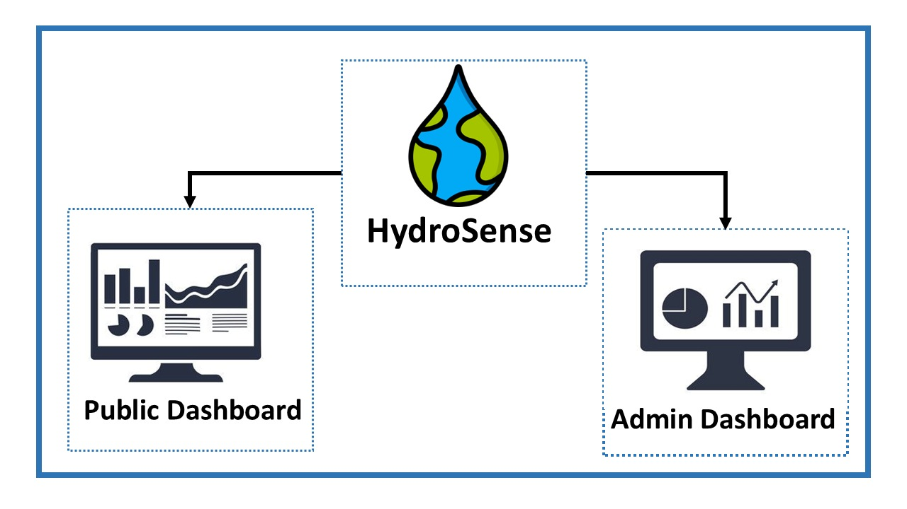
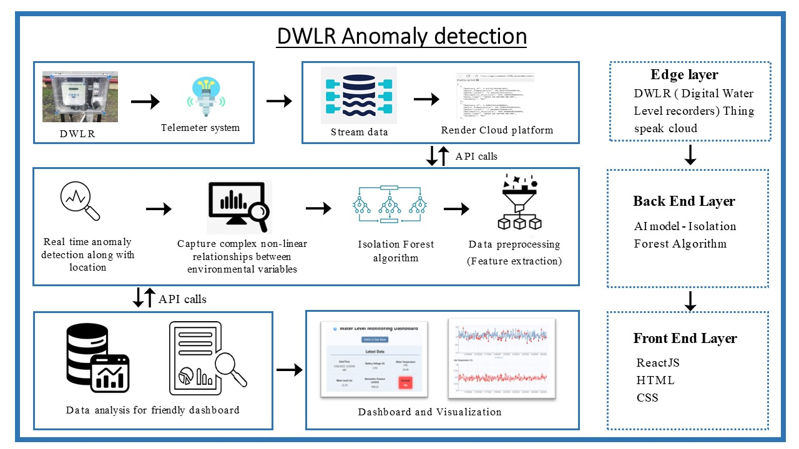
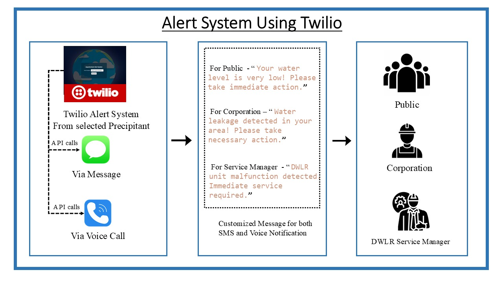
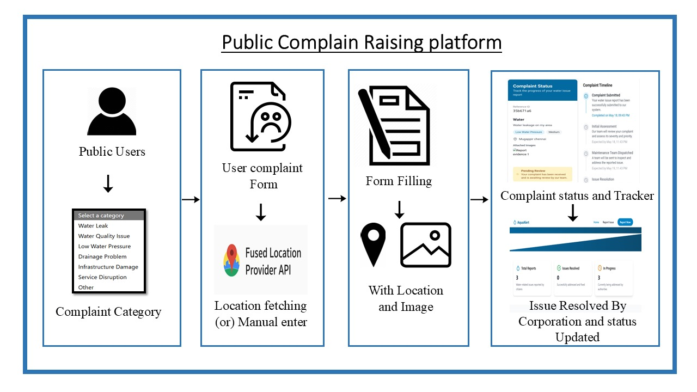
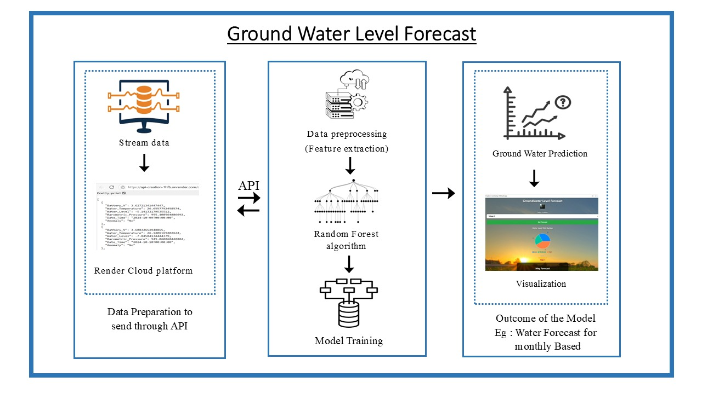
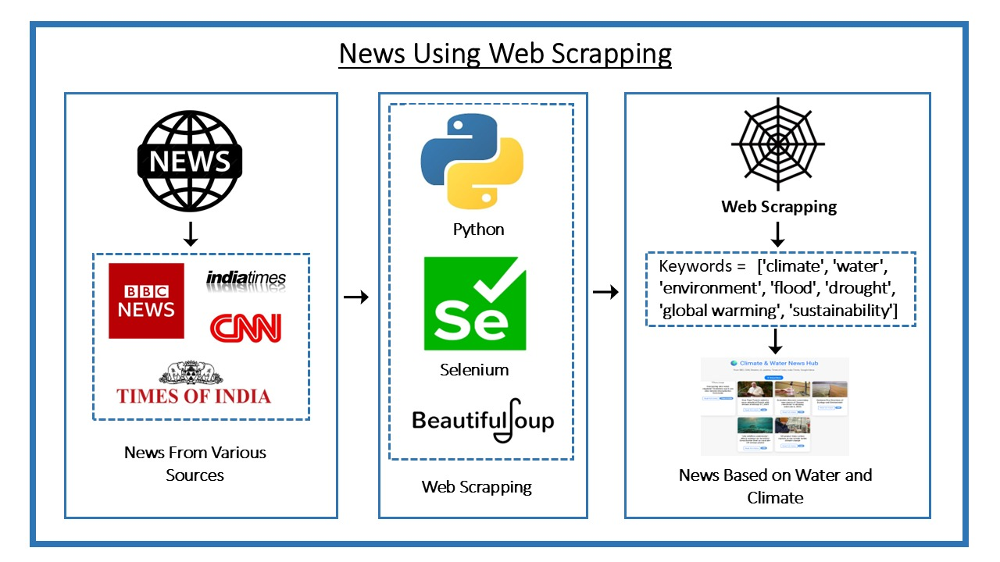

# 💧 HydroSense – Smart Water Monitoring & Anomaly Detection System  
**AIDC 2025 Final Submission – Team NeoSustain**

###  Overall Project Architecture

---

##  Problem Statement (PS)

India faces frequent water management challenges like undetected groundwater depletion, water leakages, and delayed civic response. With Digital Water Level Recorders (DWLR) installed in many regions, real-time water monitoring remains underutilized due to lack of intelligent processing, public awareness, and system integration.

---

##  Our Solution – HydroSense

**HydroSense** is an end-to-end smart water monitoring and alert system that:
- Detects **real-time anomalies** in water levels using AI
- Predicts **groundwater availability trends** using ML
- Sends **automated SMS/voice alerts** to the public & corporation
- Collects & visualizes **climate news** using live web scraping
- Allows **citizens to raise water-related complaints** with geo-tagging
- Offers **separate admin and public dashboards** for full transparency

>  "HydroSense empowers proactive action through technology, turning raw water data into life-saving insights."

---

##  Architecture Overview

- **Edge Layer**: DWLR → Telemeter → Cloud (ThingSpeak)
- **Back-End Layer**:
  - Anomaly Detection → `Isolation Forest`
  - Forecasting Model → `Random Forest`
  - Python APIs for processing, training, and alert triggers
- **Front-End Layer**:
  - Admin & Public Dashboards → `ReactJS + HTML + CSS`
  - Complaint Platform → Geo-location & Image-based Form
  - News Dashboard → Climate + Water News via `Web Scraping`

---

##  AI & ML Models Used

| Purpose | Model | Description |
|--------|-------|-------------|
| Anomaly Detection | Isolation Forest | Captures outliers in DWLR readings and flags unexpected behavior |
| Groundwater Forecast | Random Forest | Predicts future groundwater levels from past trends & environmental features |

---

##  Modules Overview

###  1. **DWLR Anomaly Detection**
- Real-time DWLR data stream (via ThingSpeak API)
- Detects abnormal fluctuations & pinpoints location
- Dashboard-friendly API output

###  2. **Alert System (Twilio)**
- Voice/SMS alerts for:
  - Public: “Water level critically low!”
  - Service Manager: “DWLR unit malfunction”
  - Corporation: “Leakage detected nearby”
- Fully automated using Twilio API

###  3. **Water & Climate News Aggregator**
- Live news scraper using Python & Selenium
- Keywords: `"climate", "water", "flood", "drought", "global warming"`
- Updates public dashboard with environmental news

###  4. **Groundwater Prediction System**
- Streams past DWLR + environmental data
- Forecasts groundwater trends monthly
- Plotted on a visual dashboard

###  5. **Public Complaint Raising Platform**
- Location-based complaint form with image upload
- Complaint tracker for status updates
- Admin dashboard to resolve issues & close tickets

---

##  Deployment Links

| Platform | Role | URL |
|----------|------|-----|
|  WebApp (Public) | For Citizens | [Updated Soon...]() |
|  WebApp (Admin) | For Corporation & Service Manager | [Updated Soon...]() |
|  Android App (Public) | Coming Soon | [Updated Soon...](#) |
|  Android App (Admin) | Coming Soon | [Updated Soon...](#) |

---

##  Project Screenshots

###  DWLR Anomaly Detection Architecture

###  Alert System Flow

###  Public Complaint Platform

###  Groundwater Forecasting Dashboard

###  Live News Feed - Climate & Water

---

##  Tech Stack

| Layer | Tools / Languages |
|-------|-------------------|
| Backend | Python, Flask, Pandas, Sklearn, Twilio |
| AI/ML | Isolation Forest, Random Forest |
| Frontend | ReactJS, HTML5, CSS3 |
| Cloud | Render, Vercel |
| Web Scraping | Selenium, BeautifulSoup |
| Data Source | DWLR Datset got from SIH'24(Madhya Pradesh Dataset) |

---

##  Final Words

HydroSense is not just a hackathon project — it’s a scalable, modular, and impactful system built to bring **clarity, awareness, and fast response** in managing India’s water ecosystem.

> “Let’s not wait for the next flood or drought. With HydroSense, we act early.”

---

##  License

[MIT License](LICENSE)

---

